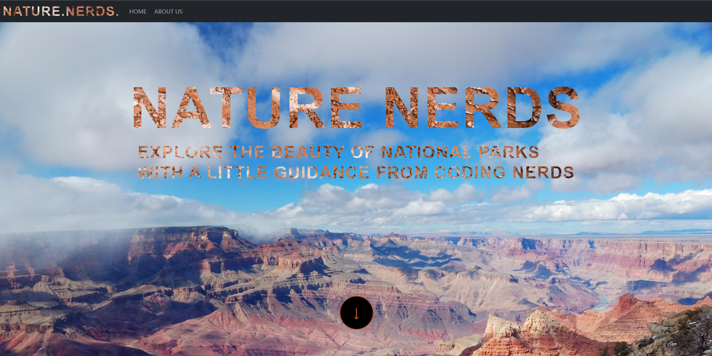

# Nature Nerds

## Introduction

Welcome to the National Park Activity Suggestions App! 🏞️🌲

This web application aims to provide users with exciting activity suggestions based on nearby national parks. Whether you're a nature enthusiast, an adventure seeker, or simply looking for a peaceful getaway, this app has got you covered! Using the power of MERN (MongoDB, Express, React, Node.js) stack, we've created an intuitive and user-friendly platform to inspire and plan your next adventure.

## Features

- **User Authentication**: Create an account, log in, and enjoy a personalized experience, save favorite activities, and access past activity suggestions.

- **Location Detection**: Automatically detect the user's location or allow users to search for a specific national park.

- **Activity Suggestions**: Based on the selected national park or user's location, the app will suggest a list of activities and things to do in that area. From hiking trails and camping spots to wildlife watching and photography locations, we've got you covered.

- **User Reviews & Ratings**: Read and leave reviews and ratings for activities, helping others to discover the best experiences.

- **Activity Planning**: Save your favorite activity ideas, plan your trips, and mark activities as "completed" after you've enjoyed them.

- **Responsive Design**: Enjoy a seamless experience on any device, be it desktop, tablet, or smartphone.

## Tech Stack

- **Frontend**: React.js, HTML, CSS
- **Backend**: Node.js, Express.js
- **Database**: MongoDB
- **Authentication**: JSON Web Tokens (JWT)
- **Maps & Geolocation**: https://api.nasa.gov/
    https://www.nps.gov/subjects/developer/api-documentation.htm

## Getting Started

To get started, create an account by clicking the "sign in" button. Once you are logged into the application, scroll down to the Search section and type in a National Park that you would like to recieve information for. Once submitted, the National Park information, along with its weather, will be returned to you. Feel free to save / favorite parks for easy access later. Don't forget to get out in the world and explore! 

Happy hiking!

### Prerequisites

- Node.js and npm installed on your machine.
- MongoDB database set up and running.
